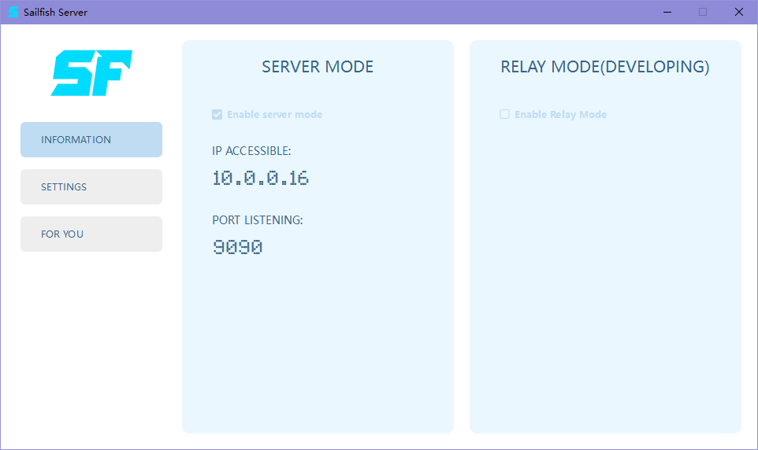
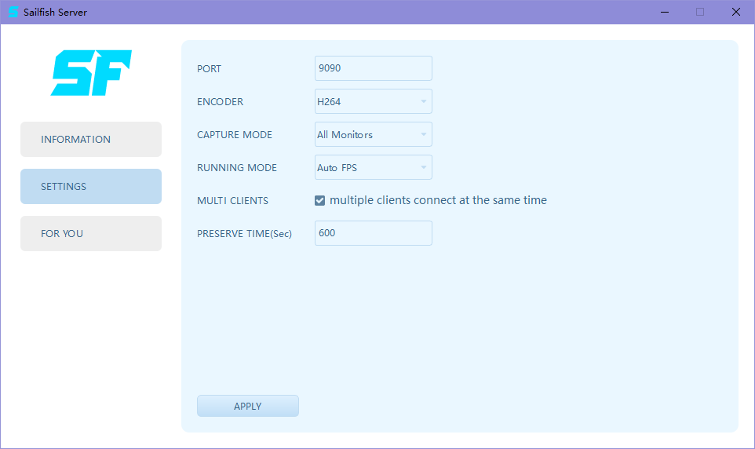
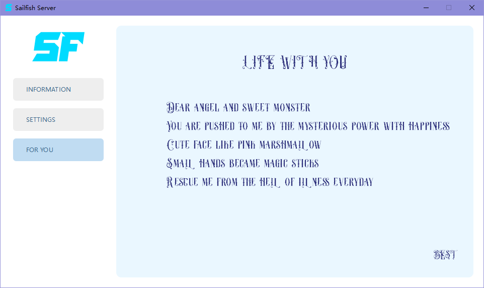

## Sailfish Remote Controller

#### This is the server side of Sailfish Remote Controller, this project is NOT well tested, so, if you want to use or publish in product environment, you should debug it yourself !  
#### The project is NOT a universal remote controller app, please read the doc following. 

#### Why?
I want to control other computers in my local area network, some of the other computers have 2 monitors. I've known that VNC is a good choice, but I need to connect many computers at same time with high FPS.  
Some business products work very well, although multiple monitors function is chargeable, therefore I start to develop this project.

#### Features  
- Support H264 and H265, both hardware and software with ffmpeg
- Support multiple clients at same time
- Support 2 or more monitors
- Support high FPS

#### Roadmap
- Relay mode
- File transfer
- Different monitors size
- Encode with NVENC directly
- Web client

#### Server main ui

#### Server settings ui

#### Yes, A poem, for my children.
