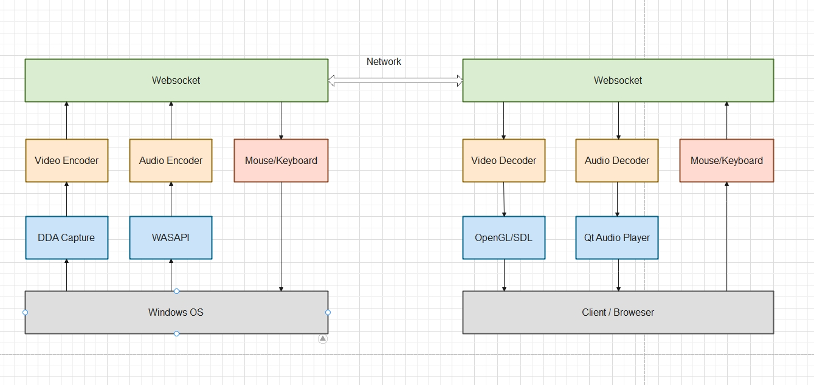

## Sailfish Remote Controller

[简体中文](README_CN.md)

#### This project is intended as a tutorial to teach students how to program with C++.
#### This is the server side of Sailfish Remote Controller, this project is NOT well tested, so, if you want to use or publish in product environment, you should debug it yourself !

#### Basic framework

#### Here is a list of the used technologies that you may want to learn 
- C++ for both server and client
- Qt for the UI
- FFmpeg for encoding and decoding
- OpenGL for client displaying
- Opus for audio encoding and decoding
- VCPKG for package manager
- DDA(Desktop Duplication API) for capturing image
- Libyuv for converting image's format
- Websocket for sending & receiving data packages
- ProtoBuf for serializing data
- LevelDB for saving simple config

#### Here is the tutorial
- [0. Prepare environment & How to build ](docs/0_Prepare.md)
- [1. How to capture an image of your screen with DDA(Desktop Duplication Api)](docs/1_Capture_screen.md)
- [2. How to convert to I420](docs/2_Convert_to_I420.md)
- [3. How to encode an image by FFmpeg](docs/3_FFmpeg_encoder.md)
- [4. How to pack the encoded frame to protobuf and send via network](docs/4_Pack_to_Protobuf.md)
- [5. How to capture a cursor](docs/5_Capture_cursor.md)
- [6. How to capture audio and encode by OPUS](docs/6_Capture_audio.md)
- [7. How to Replay cursor and keyboard events](docs/7_Replay.md)
- [8. How to decode a encoded frame](docs/8_Decode.md)
- [9. How to render frame by OpenGL](docs/9_Render_OpenGL.md)

#### Features  
- Support H264 and H265, both hardware and software with ffmpeg
- Support multiple clients at same time
- Support 1 monitor or 2 monitors
- Support high FPS
- Support clipboard for TEXT
- Support audio
- Support detail debug information

#### You may want to do:
- Relay mode
- File transfer
- Different monitors size
- Encode with NVENC directly
- Web client
#### How to implement the features above?
- Relay mode: create another program, both server and client connect to it, then relay data.
- File transfer: start a server int [Server Side], then copy data via this server.
- Different monitors size: reference to the figure

- Encode with NVENC directly: you should modify here src/capture/DDACapture.cpp, stop to copy to CPU side, you should share to another ID3DTexture2D which is used by NVENC.
```c++
int DDACapture::CaptureNextFrameInternal(const std::shared_ptr<OutputDuplication>& out_dup, int timeout) {
    ...
    // modify here
    if (use_cache) {
        auto cached_texture = cached_textures_[out_dup->dup_index_];
        d3d_device_context->CopyResource(cpu_side_textures_[out_dup->dup_index_], cached_texture);
        } else {
        d3d_device_context->CopyResource(cpu_side_textures_[out_dup->dup_index_], gpu_side_texture);
        if (cached_textures_.find(out_dup->dup_index_) != cached_textures_.end()) {
        d3d_device_context->CopyResource(cached_textures_[out_dup->dup_index_], gpu_side_texture);
        }
    } 
    ...
}
```
- Web client: see [Here(Github)](https://github.com/w3c/webcodecs) and [Here(Demo)](https://w3c.github.io/webcodecs/samples/video-decode-display/)

### Here are Server's UI and instruction
#### Server main ui
- IP Accessible: Your computer's IP, one or more
- Port Listening: The port that server is listening on


#### Server settings ui
- Encoder: H264 or H265, choose Hxxx_nvenc first
- Capture Mode: Capture single monitor or all monitors at same time, I'm normally using 2 monitors.
- Running Mode: "Auto fps" means to capture an image when the content has changed while "Try fixing fps" will use a cached image.
- Multi clients: Enable multiple clients to connect at same time or not.
- Preserve time: After the duration in seconds, the image capture, audio capture ,etc, will be destroyed.


#### Yes, A poem
#### Life with you
- Dear angel and sweet monster
- You are pushed to me by the mysterious power with happiness
- cute face like pink marshmallow
- Small hands became magic sticks
- Rescue me from the hell of illness everyday


### Here are Client's UI and instruction

#### Client main ui
- Double click or right click to start a stream
- Click the + button to add new stream
- Right click to edit or delete


#### Client settings ui
- fix the menu at top: true -> the menu will stay on title bar, false -> the menu will stay under title bar
- audio enabled: audio, see below
- clipboard enabled: clipboard, see below
- multiple monitors display mode: two separated windows or one combined window


#### Running & Debug


#### 2 Monitors at same time


#### Yes, a poem again
#### Together
- Birds build nest and sleep in
- Shining diamonds fall off on my bed
- Gave them back to the sprites
- I am gifted melliferous toffee today
- We will sit at the beach in the future
- Wait for free wind to full in our sleeves


#### If you run Server in Virtual Machine, please set the resolution to a proper size, so the frame can be encoded by FFmpeg.


#### License
Do what you want to do.