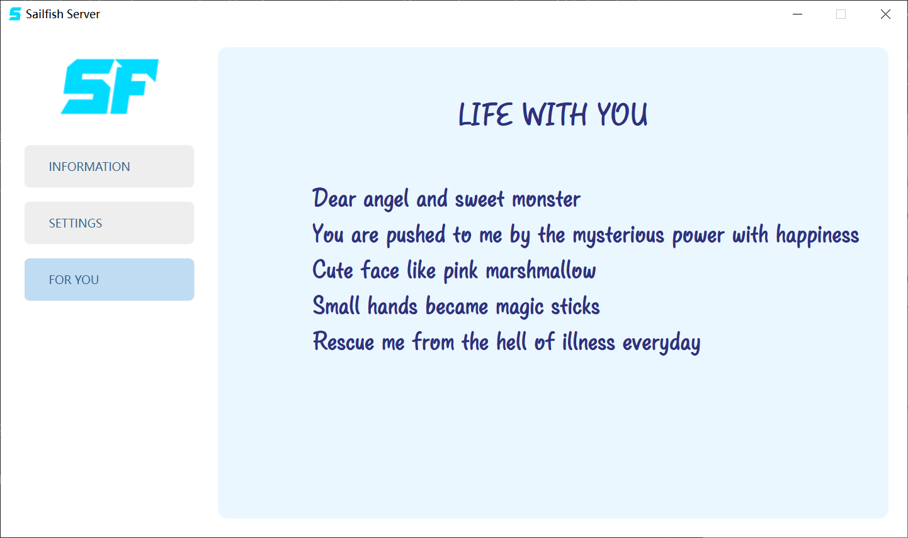

## Sailfish Remote Controller

[简体中文](README_CN.md)

#### 这是Sailfish Remote Controller的服务端, 这个项目并没有很好的测试, 因此, 如果你想使用或者在生产环境中发布，你需要自己调试好它 !
#### 这并不是一个通用的远程控制软件，请阅读下面的文档.

#### Why?
I want to control other computers in my local area network, some of the other computers have 2 monitors. I've known that VNC is a good choice, but I need to connect many computers at same time with high FPS.  
Some business products work very well, although multiple monitors function is chargeable, therefore I start to develop this project.

#### Features
- Support H264 and H265, both hardware and software with ffmpeg
- Support multiple clients at same time
- Support 2 or more monitors
- Support high FPS
- Support clipboard for TEXT
- Support audio

#### Roadmap
- Relay mode
- File transfer
- Different monitors size
- Encode with NVENC directly
- Web client

### Here are Server's UI and instruction
#### Server main ui
- IP Accessible: Your computer's IP, one or more
- Port Listening: The port that server is listening on

#### Server settings ui
- Encoder: H264 or H265, choose Hxxx_nvenc first
- Capture Mode: Capture single monitor or all monitors at same time, I'm normally using 2 monitors.
- Running Mode: "Auto fps" means to capture an image when the content has changed while "Try fixing fps" will use a cached image.
- Multi clients: Enable multiple clients to connect at same time or not.
- Preserve time: After the duration in seconds, the image capture, audio capture ,etc, will be destroyed.

#### Yes, A poem, for my children.
#### I have some incurable illnesses, thanks to my angels, I can overcome these serious matters.
#### Life with you
- Dear angel and sweet monster
- You are pushed to me by the mysterious power with happiness
- cute face like pink marshmallow
- Small hands became magic sticks
- Rescue me from the hell of illness everyday

