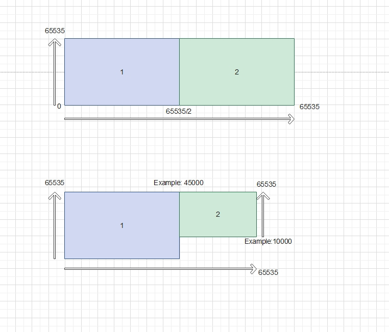
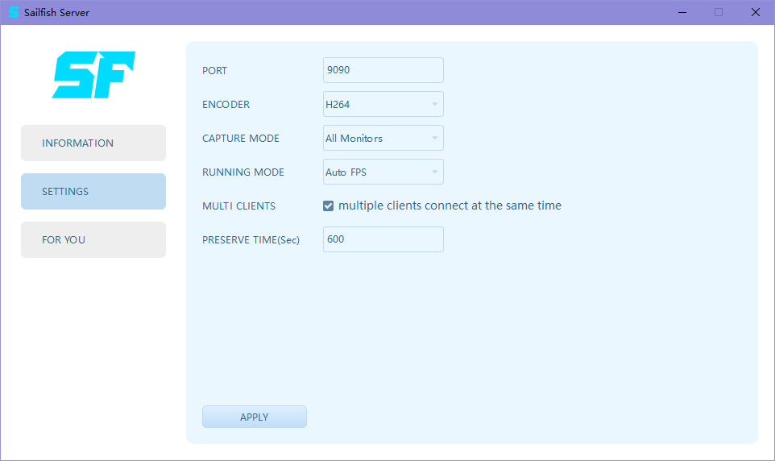
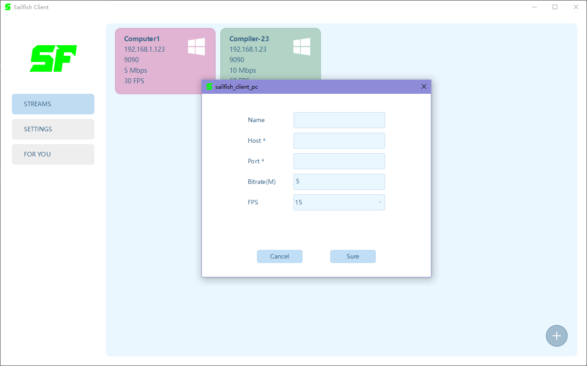
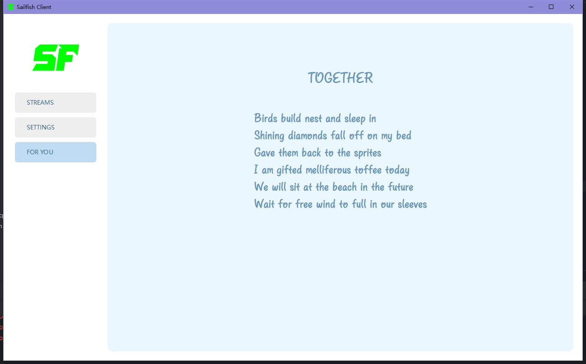
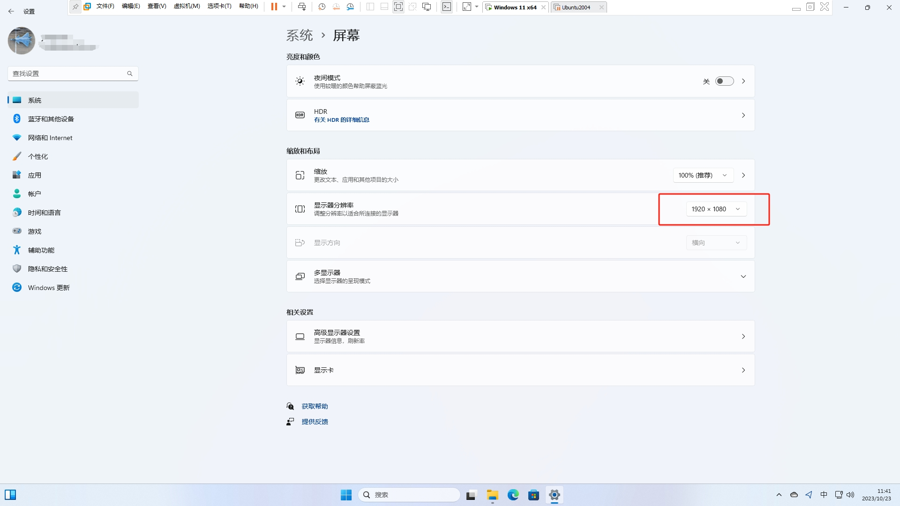

## Sailfish Remote Controller

#### 这个项目本身为教C++而生。
#### 这个项目没有完整的测试，如果你想使用，请自己好好调试。

#### Basic framework

#### 你能学到什么
- C++语言
- Qt做的UI
- FFmpeg视频编解码
- OpenGL渲染
- Opus音频编解码
- VCPKG C++包管理
- DDA(Desktop Duplication API)Windows桌面捕获功能
- Libyuv转换
- Websocket网络
- ProtoBuf
- LevelDB

#### Here is the tutorial
- [0. 准备环境 源码编译](docs/0_Prepare.md)
- [1. 使用DDA(Desktop Duplication Api)捕获桌面](docs/1_Capture_screen.md)
- [2. 转换为I420](docs/2_Convert_to_I420.md)
- [3. 使用FFmpeg编码](docs/3_FFmpeg_encoder.md)
- [4. 打包成Protobuf发送](docs/4_Pack_to_Protobuf.md)
- [5. 捕获鼠标](docs/5_Capture_cursor.md)
- [6. 音频采集和OPUS编码](docs/6_Capture_audio.md)
- [7. 重放鼠标键盘事件](docs/7_Replay.md)
- [8. 视频解码](docs/8_Decode.md)
- [9. 使用OpenGL渲染](docs/9_Render_OpenGL.md)

#### 特性
- Support 软编&硬编 H264&H265
- Support 多个客户端连接
- Support 1 monitor or 2 monitors
- Support 高 FPS
- Support 文本剪切板
- Support 音频
- Support 详细的调试信息

#### 如有需要，请自己完善:
- 中继模式
- 文件传输
- 2个屏幕状态下，如果屏幕大小不一致的鼠标坐标计算
- 使用NVENC直接硬编，这时候就不用FFmpeg，省去libyuv转换这一步
- 使用webcodec解码后，直接在浏览器显示，不再需要C++客户端
#### 实现的一些方式可供参考
- 中继模式: 写一个websocket服务，客户端和服务端都连接它，将它部署在公网中转数据
- 文件传输: 服务端起一个Server，然后用来双向拷贝数据
- 不同屏幕的尺寸下，坐标如何计算，根据这个图来计算，我把数据的意义做到图上了。
  
- 直接使用NVENC: 在这个文件里 src/capture/DDACapture.cpp, 不要拷贝，直接将ID3DTexture2D 分享给 NVENC，它会直接编码.
```c++
int DDACapture::CaptureNextFrameInternal(const std::shared_ptr<OutputDuplication>& out_dup, int timeout) {
    ...
    // modify here
    if (use_cache) {
        auto cached_texture = cached_textures_[out_dup->dup_index_];
        d3d_device_context->CopyResource(cpu_side_textures_[out_dup->dup_index_], cached_texture);
        } else {
        d3d_device_context->CopyResource(cpu_side_textures_[out_dup->dup_index_], gpu_side_texture);
        if (cached_textures_.find(out_dup->dup_index_) != cached_textures_.end()) {
        d3d_device_context->CopyResource(cached_textures_[out_dup->dup_index_], gpu_side_texture);
        }
    } 
    ...
}
```
- 网页端的webcodec参考这里: see [Here(Github)](https://github.com/w3c/webcodecs) and [Here(Demo)](https://w3c.github.io/webcodecs/samples/video-decode-display/)

### Here are Server's UI and instruction
#### Server main ui
- IP Accessible: Your computer's IP, one or more
- Port Listening: The port that server is listening on


#### Server settings ui
- Encoder: H264 or H265, choose Hxxx_nvenc first
- Capture Mode: Capture single monitor or all monitors at same time, I'm normally using 2 monitors.
- Running Mode: "Auto fps" means to capture an image when the content has changed while "Try fixing fps" will use a cached image.
- Multi clients: Enable multiple clients to connect at same time or not.
- Preserve time: After the duration in seconds, the image capture, audio capture ,etc, will be destroyed.


#### Yes, A poem
#### Life with you
- Dear angel and sweet monster
- You are pushed to me by the mysterious power with happiness
- cute face like pink marshmallow
- Small hands became magic sticks
- Rescue me from the hell of illness everyday


### Here are Client's UI and instruction

#### Client main ui
- Double click or right click to start a stream
- Click the + button to add new stream
- Right click to edit or delete




#### Client settings ui
- fix the menu at top: true -> the menu will stay on title bar, false -> the menu will stay under title bar
- audio enabled: audio, see below
- clipboard enabled: clipboard, see below
- multiple monitors display mode: two separated windows or one combined window


#### Running & Debug


#### 2 Monitors at same time


#### Yes, a poem again
#### Together
- Birds build nest and sleep in
- Shining diamonds fall off on my bed
- Gave them back to the sprites
- I am gifted melliferous toffee today
- We will sit at the beach in the future
- Wait for free wind to full in our sleeves




#### If you run Server in Virtual Machine, please set the resolution to a proper size, so the frame can be encoded by FFmpeg.
