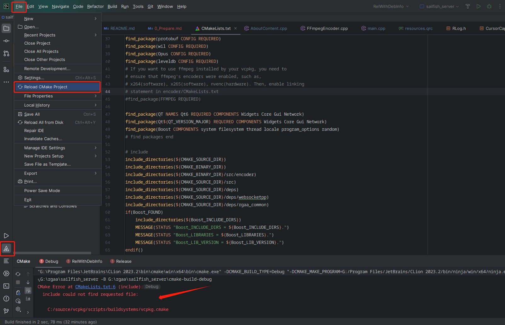

**If you don't know how to install these software, google yourself, please.**

#### 1. Install Qt6.4
[Download in website](https://www.qt.io/download)  
Tutorials, eg:  
- [EN](https://subscription.packtpub.com/book/programming/9781800204584/2/ch02lvl1sec06/downloading-and-installing-qt)
- [CN](https://blog.csdn.net/yanchenyu365/article/details/124499087)

#### 2. Install vcpkg
[vcpkg github address](https://github.com/microsoft/vcpkg)  
Tutorials, eg:  
- [CN](https://zhuanlan.zhihu.com/p/153199835)

#### 2.0 Install command
- Example
```c++
./vcpkg.exe install wil:x64-windows
```
- Follow the output and use it in your CMakeLists.txt
```c++
# this is heuristically generated, and may not be correct
find_package(wil CONFIG REQUIRED)
target_link_libraries(main PRIVATE WIL::WIL)
```

##### 2.1 Install packages by vcpkg, here is a list
- libyuv
- protobuf
- wil
- Opus
- leveldb
- boost

#### 3. Modify env.cmake in root directory
- Change the path to your own.
```cmake
if(WIN32)
    set(VCPKG_ROOT C:/source/vcpkg)
    set(QT_ROOT C:/Qt/Qt6.4/6.4.0/msvc2019_64)
    set(CMAKE_PREFIX_PATH ${QT_ROOT}/lib/cmake)
elseif (UNIX)

endif ()
```

#### 4. Refresh cmake, fix error if occurred


#### 5. CMake success, then build it