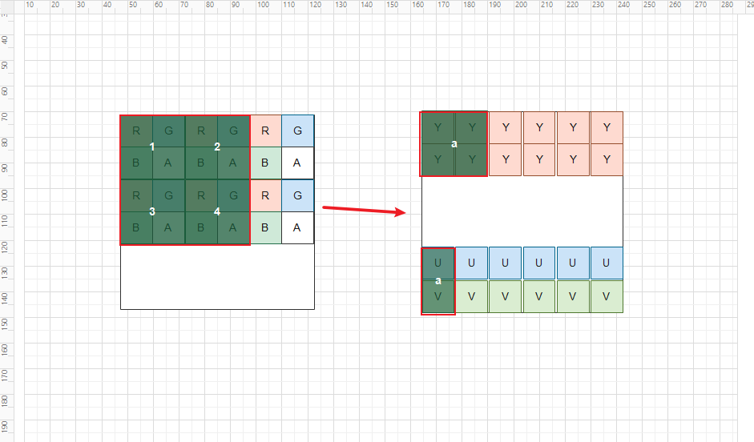

- In [1_Capture_screen.md](1_Capture_screen.md), we've initialized and captured. But we still need to talk about following code.

```c++
void Capture...() { 
    std::vector<uint8_t> yuv_frame_data;
    yuv_frame_data.resize(1.5 * width * height);
    size_t pixel_size = width * height;

    const int uv_stride = width >> 1;
    uint8_t *y = yuv_frame_data.data();
    uint8_t *u = y + pixel_size;
    uint8_t *v = u + (pixel_size >> 2);

    if (DXGI_FORMAT_B8G8R8A8_UNORM == desc.Format) {
        libyuv::ARGBToI420((uint8_t *) sr.pData, sr.RowPitch, y, width, u, uv_stride, v, uv_stride, width, height);
    } else if (DXGI_FORMAT_R8G8B8A8_UNORM == desc.Format) {
        libyuv::ABGRToI420((uint8_t *) sr.pData, sr.RowPitch, y, width, u, uv_stride, v, uv_stride, width, height);
    } else {
        libyuv::ARGBToI420((uint8_t *) sr.pData, sr.RowPitch, y, width, u, uv_stride, v, uv_stride, width, height);
    }
}
```
##### In a nutshell, we convert image like this(ignore rgba order in the picture, because of different format with rgba,bgra...):


- We don't care about alpha channel, alpha will be dropped after converting.
- As the picture showing, 4 RGB pixels = 12 Bytes(4 x 3(R+G+B))   ===Convert===>   6 Bytes(4Y + U + V), so, the following code use 1.5 as multiplication factor
```c++
yuv_frame_data.resize(1.5 * width * height);
```

- Y => width x height
- U => Y's size/4
- V => Y's size/4

